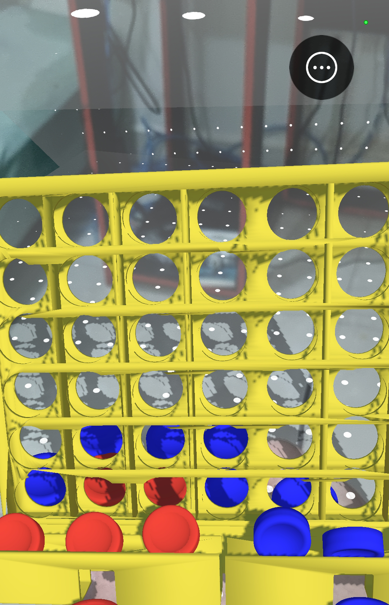

# Connect4 AR

## Description

**Connect4 AR** is an (unfinished) augmented reality version of the classic Connect 4 game, developed in Unity. The game allows players to interact with a Connect 4 board in AR, using their device's camera to detect a target image and generate the board in 3D. Players alternate between red and blue pieces, trying to align four pieces in a row, whether horizontally, vertically, or diagonally.


The board is rendered by detecting and tracking a real-world image.


## Setup guide

1. **Clone the repository:**
   ```bash
   git clone https://github.com/inteiros/connect4-ar.git
   ```

2. **Configure the target image in the project:**

Go to the AR Tracked Image Manager in Unity and then load your Reference Image Library with the desired target image (name it connect4board so it is associated with the right prefab).

3. **Build and Deploy:**

Select the desired plataform (Android or IOS), plug your device, configure the build settings as you wish and then build the project.


## Gameplay

Point your camera at the target image from the Reference Image Library to generate the board. Once a plane is detected behind the board, you can place red or blue pieces, selected from the menu.




